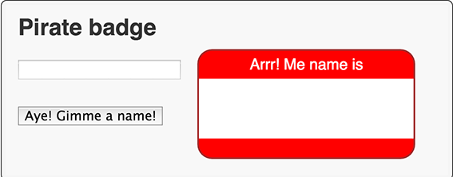

#步骤 4 ：创建一个 PirateName 的类

在这一步中，你改变的仅是 Dart 的代码，你可以自己为你新建的类起个名字，当创建这个类的一个实例，随机选择一个名字和称谓，或者你可以提供一个名字和称谓给构造函数。

##编辑 piratebadge.dart
在文件的顶部加入 import  
  
```
import 'dart:html';

import 'dart:math' show Random;
piratebadge.dart
```     
 
##关键信息
- 使用 `show` 关键字，你可以只导入你需要的类，方法，和属性。
- `Random ` 提供了一个随机数的发生器。  

---
加入一个类的声明在在文件的底部  

```
...

class PirateName {
}
```  

- 这个类的声明给类提供一个名字  

---
创建一个类级别的 Random 实体

```
class PirateName {
  static final Random indexGen = new Random();
}
```

- `static` 定义类级别的字段，就是说随机数发生器被所有的类实例共享。
- Dart 编辑器强调静态名字。
-  使用 `new` 调用一个构造函数。  

---  
在类中加入两个成员变量,一个定义 first name ，一个定义 appellation 。  

```
class PirateName {
  static final Random indexGen = new Random();
  String _firstName;
  String _appellation;
}
``` 
- 私有变量用`(_).`强调。Dart 没有 private 关键字。  
 
---
在类内创建两个静态的 List ，提供 names 和 appellations 两个集合供选择。

```
class PirateName {
  ...
  static final List names = [
    'Anne', 'Mary', 'Jack', 'Morgan', 'Roger',
    'Bill', 'Ragnar', 'Ed', 'John', 'Jane' ];
  static final List appellations = [
    'Jackal', 'King', 'Red', 'Stalwart', 'Axe',
    'Young', 'Brave', 'Eager', 'Wily', 'Zesty'];
}
```
- `final` 修饰的变量不能更改。
- 列表是 Dart 内置的，使用 List 来创建。
- List 类提供 API 给列表。  

---
 给类提供一个构造函数。
 
```
 class PirateName {
  ...
  PirateName({String firstName, String appellation}) {
    if (firstName == null) {
      _firstName = names[indexGen.nextInt(names.length)];
    } else {
      _firstName = firstName;
    }
    if (appellation == null) {
      _appellation = appellations[indexGen.nextInt(appellations.length)];
    } else {
      _appellation = appellation;
    }
  }
}

```

- 构造函数名和类名相同。
- 参数被包含在花括号 `({ })` 是可选的被命名的参数。
- `nextInt()` 函数得到一个随机整数从随机数发生器里。
- 使用方括号 `([ ])` 为列表添加索引。
- 使用 `length` 属性返回列表中元素的个数。
- 代码使用随机数作为列表的索引。    

---
提供一个 `getter` 给私有字段。

```
class PirateName {
  ...
  String get pirateName =>
    _firstName.isEmpty ? '' : '$_firstName the $_appellation';
}
```  
- Getters 是一个特别的方法，提供访问对象的属性。
- 三元运算符 `?:` 是 `if-then-else` 语句的简略写法。
- 字符串插入  `('$_firstName the $_appellation') ` 让我们很容易从其他对象构建字符串。
- 大箭头 `( => expr; )` 是 `{ return expr; }` 语法的一个简称。   
 
---
重写 `toString()` 方法。  

```
class PirateName {
  ...
  String toString() => pirateName;
}
```  
- 因为对象实现 `toString()` 方法没有给很多的信息，很多类重写 `toString()` 。  
- 当你调用 `print(anObject)` 得到字符串，返回值是 `anObject.toString()` 得到的。  
- 重写 `toString()` 在的调试和输出的时候特别有用。  
 
---
修改 `setBadgeName()` 方法，使用 PirateName 而不是 String 。    

```
void setBadgeName(PirateName newName) {
  querySelector('#badgeName').text = newName.pirateName;
}
```
- 代码调用 getter 得到 PirateName 作为一个字符串。  
  
---
更改 `updateBadge()` 基于输入字段的值生成 PirateName 。  

```
void updateBadge(Event e) {
  String inputName = (e.target as InputElement).value;
  
  setBadgeName(new PirateName(firstName: inputName));
  ...
}
```
- 调用构造函数给可选的命名参数提供一个值。  

---  
更改 ` generateBadge() ` 生成一个 PirateName 而不是使用 `Anne Bonney`。

```
void generateBadge(Event e) {
  setBadgeName(new PirateName());
}

```  
- 在这种情况下，通过无参数调用构造函数。

##运行应用  
使用 ` File > Save All` 保存。  

运行应用正确点击 `piratebadge.html` 并选择 ` Run in Dartium` 。

把你的应用和下面的比较。

在输入框中输入。删除输入字段。点击按钮。  


  


  
