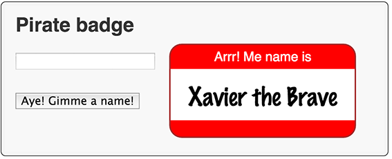

#步骤 6：从 JSON 编码的文件里读取名字

在这一步中，你需要更改 PirateName 类以实现从 JSON 文件中获取名字的列表。这将给你机会添加更多的名字进程序。 

##创建 piratenames.json  
 
使用`File > New File… ` 创建一个名为 `piratenames.json` 含有以下内容的 JSON 编码的文件。
把文件放在 `1-blankbadge` 你以前写过的 Dart 和 HTML 文件的旁边。

```
{ "names": [ "Anne", "Bette", "Cate", "Dawn",
        "Elise", "Faye", "Ginger", "Harriot",
        "Izzy", "Jane", "Kaye", "Liz",
        "Maria", "Nell", "Olive", "Pat",
        "Queenie", "Rae", "Sal", "Tam",
        "Uma", "Violet", "Wilma", "Xana",
        "Yvonne", "Zelda",
        "Abe", "Billy", "Caleb", "Davie",
        "Eb", "Frank", "Gabe", "House",
        "Icarus", "Jack", "Kurt", "Larry",
        "Mike", "Nolan", "Oliver", "Pat",
        "Quib", "Roy", "Sal", "Tom",
        "Ube", "Val", "Walt", "Xavier",
        "Yvan", "Zeb"],
  "appellations": [ "Awesome", "Captain",
        "Even", "Fighter", "Great", "Hearty",
        "Jackal", "King", "Lord",
        "Mighty", "Noble", "Old", "Powerful",
        "Quick", "Red", "Stalwart", "Tank",
        "Ultimate", "Vicious", "Wily", "aXe", "Young",
        "Brave", "Eager",
        "Kind", "Sandy",
        "Xeric", "Yellow", "Zesty"]}
        
```

###关键信息

- 文件包含 JSON 编码的 map ，它包含两个字符串列表。

##编辑 piratebadge.html
显示输入框和按钮

```
...
  <div>
    <input type="text" id="inputName" maxlength="15" disabled>
  </div>
  <div>
    <button id="generateButton" disabled>Aye! Gimme a name!</button>
  </div>
...

```
- Dart 代码启用输入框和按钮，然后名字成功从 JSON 文件中读出来。

##编辑 piratebadge.dart
在文件顶部添加一个 `import`  

```
import 'dart:html';
import 'dart:math' show Random;
import 'dart:convert' show JSON;

import 'dart:async' show Future;

```  

- `dart:async` 库提供异步编程。
-  `Future` 提供一个方式在将来得到一个值。（对于 JavaScript 开发者：Futures 和 Promises 一样。）

---
把 `names` 和 `appellations` 替换成这些静态的，空的列表。

```
class PirateName {
  ...
  static List<String> names = [];
  static List<String> appellations = [];
  ...
}
```

- 记得从这些声明中移除 `final` 。 

- `[ ]` 相当于 `new List()` 。  

- List 是一个通用的类型- List 可以包含任何类型的对象。如果你打算让一个列表只包含字符串，你可以把它声明成为 `List<String>` 。
___
添加两个静态的方法到 PirateName 类：

```
class PirateName {
  ...

  static Future readyThePirates() async {
    String path = 'piratenames.json';
    String jsonString = await HttpRequest.getString(path);
    _parsePirateNamesFromJSON(jsonString);
  }
  
  static _parsePirateNamesFromJSON(String jsonString) {
    Map pirateNames = JSON.decode(jsonString);
    names = pirateNames['names'];
    appellations = pirateNames['appellations'];
  }
}
```  

- `readyThePirates` 被 `async` 关键字标记。一个异步的方法立即返回一个 `Future` ，所以调用者在等待方法完成时有机会做其他事。

- `HttpRequest` 用来检索来自 URL 的数据时使用的。

-  `getString()` 是一个方便的方法做一个简单的 GET 请求并返回字符串。

-  `getString()` 是异步的，它建立了一个 GET 请求，当完成 GET 请求的时候返回一个 `Future`。

-  `await` 表达式，你只可以在异步的方法里使用。执行暂停直到 GET 请求完成。（当 `Future` 在 `getString()` 完成时返回）
- GET 请求返回 JSON 字符串之后，代码从字符串中提取私有名字和称谓。

---
添加一个顶级变量

```
SpanElement badgeNameElement;

void main() {
  ...
}
```
- 存储  span 元素以便重复使用，而不是从 DOM 里重复查询它。

___ 

对 `main()` 函数做这些更改

```
void main() {
  InputElement inputField = querySelector('#inputName');
  inputField.onInput.listen(updateBadge);
  genButton = querySelector('#generateButton');
  genButton.onClick.listen(generateBadge);
  
  badgeNameElement = querySelector('#badgeName');
  ...
}
```
- 在全局变量存储这些 span 元素，同时在局部变量里存储 input 元素。

___

然后添加代码获得 JSON 文件里面的名字，同时处理好异常。

```
main() async {
  ...
  
  try {
    await PirateName.readyThePirates();
    //on success
    inputField.disabled = false; //enable
    genButton.disabled = false; //enable
    setBadgeName(getBadgeNameFromStorage());
  } catch (arrr) {
    print('Error initializing pirate names: $arrr');
    badgeNameElement.text = 'Arrr! No names.';
  }
}
```

- `async` 修饰方法体，这样方法就可以 `async` 关键字了。去除 `void` 给 `main` 返回值。异步方法必须返回一个将来，所以你可以指定返回类型或让它空白的。
- 调用 ` readyThePirates()` 方法，立即返回一个 Future 。
- 使用 `await ` 关键字执行暂停直到将来完成。
- 当 将来通过 `readyThePirates()` 成功完成返回，设置界面。
- 使用 `try` 和 `catch` 来检测和处理错误。
___

##运行应用
通过 `File > Save All` 保存文件。

运行应用通过正确点击 `piratebadge.html`，选择 `Run in Dartium`。

如果你想看到应用找不到 `.json` 文件发生什么，在代码里改变文件的名字并重新运行这个程序。
把你的应用和下面的最终版本对比一下

 
